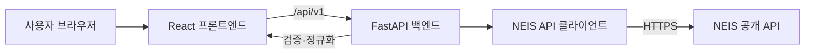

# 급식 배틀 - 학교 급식 조회 앱 TRD

| 메타데이터 | 값 |
| --- | --- |
| 문서 ID | TRD-BSL-001 |
| 버전 | 1.0 |
| 상태 | 승인됨 |
| 작성자 | 프로젝트 팀 |
| 기술 책임자 | 프로젝트 소유자 |
| 검토자·승인자 | 프로젝트 소유자 |
| 작성일 | 2026-08-17 |
| 최종 수정일 | 2026-08-17 |
| 승인일 | 2026-08-17 |
| 대상 릴리스 | MVP |
| 기준 PRD | [`PRD.md`](PRD.md) 1.0 |
| 관련 이슈 | [kpiiorkr/bsl#4](https://github.com/kpiiorkr/bsl/issues/4) |
| 외부 API 명세 | `data/openapi.json` |

## 변경 이력

| 버전 | 변경일 | 작성자 | 변경 내용 |
| --- | --- | --- | --- |
| 0.1 | 2026-08-17 | 프로젝트 팀 | 승인된 PRD 1.0 기반 최초 기술 설계 |
| 0.2 | 2026-08-17 | 프로젝트 팀 | 내부 OpenAPI Payload와 테스트 프레임워크 구체화 |
| 1.0 | 2026-08-17 | 프로젝트 팀 | 기술 설계 검토 및 승인 |

## 1. 문서 목적

이 문서는 승인된 `PRD.md` 1.0을 구현하기 위한 기술 요구사항과 설계를
정의한다. React 프론트엔드, Python 백엔드, NEIS 공개 API 연동, 내부 API
계약, Docker Compose 실행 환경 및 테스트 전략을 다룬다.

## 2. 설계 원칙과 제약

- 프론트엔드는 NEIS API를 직접 호출하지 않고 백엔드 API만 호출한다.
- NEIS API 키는 백엔드 환경 변수로만 주입하고 브라우저, 소스 코드, 이미지
  또는 로그에 노출하지 않는다.
- 외부 NEIS API 계약은 `data/openapi.json`을 단일 기준으로 사용한다.
- 프론트엔드와 백엔드 사이의 계약은 리포지토리 루트의
  `src/openapi.json`으로 정의한다.
- 외부 응답을 프론트엔드에 그대로 전달하지 않고 백엔드 도메인 모델로
  검증하고 정규화한다.
- 날짜와 API 계약에는 ISO 8601 형식을 사용하고, 사용자 화면에는 한국어
  로케일 형식으로 표시한다.
- Must have 요구사항을 우선 구현하며 Should have와 Could have가 핵심 기능의
  구현을 지연시키지 않게 한다.

## 3. 기술 스택

| 영역 | 선택 기술 | 용도 |
| --- | --- | --- |
| 프론트엔드 | React, TypeScript, Vite | SPA UI와 정적 빌드 |
| UI | Material UI, MUI X Date Pickers | Material Design 3 기반 컴포넌트와 날짜 선택 |
| 프론트엔드 테스트 | Vitest, React Testing Library, Mock Service Worker | 백엔드 경계를 포함한 컴포넌트 통합 테스트 |
| 백엔드 | Python, FastAPI, Pydantic | 내부 REST API와 요청·응답 검증 |
| 외부 HTTP | HTTPX | 비동기 NEIS API 클라이언트 |
| 백엔드 테스트 | pytest, pytest-asyncio, RESPX | 비동기 단위 테스트와 NEIS HTTP 모의 |
| 계약 테스트 | openapi-spec-validator, Schemathesis | OpenAPI 문서와 실제 백엔드 응답 검증 |
| E2E | Playwright | 브라우저 기반 전체 사용자 흐름 검증 |
| 실행 환경 | Docker, Docker Compose | 프론트엔드와 백엔드 빌드·실행 |

각 도구는 구현 시점의 지원되는 안정 버전을 선택하고 잠금 파일에 고정한다.
MUI X의 유료 기능에 의존하지 않도록 시작일과 종료일에 각각 Date Picker를
사용한다.

## 4. 시스템 아키텍처



### 4.1 프론트엔드 책임

- 학교 검색, 학교 선택, 날짜 범위 및 조회 실행 상태를 관리한다.
- 두 글자 미만의 검색어와 미완성·역순·31일 초과 날짜 범위를 선제 검증한다.
- 백엔드 API의 로딩, 성공, 빈 결과 및 오류 상태를 구분해 표시한다.
- 학교 검색 결과를 최대 20개까지 표시하고 추가 결과가 있으면 검색어 구체화를
  안내한다.
- 중식 결과를 날짜 오름차순의 카드 또는 목록으로 렌더링한다.
- Material UI의 의미 있는 HTML과 ARIA 속성을 사용해 키보드 및 보조 기술
  접근을 지원한다.

### 4.2 백엔드 책임

- 내부 API 입력을 검증하고 날짜 범위와 검색 제한 정책을 강제한다.
- NEIS `schoolInfo`와 `mealServiceDietInfo` API를 인증된 서버 간 요청으로
  호출한다.
- NEIS 응답의 헤더, 결과 코드 및 행 데이터를 검증한다.
- NEIS 필드와 HTML 줄바꿈을 프론트엔드 도메인 모델로 정규화한다.
- 외부 API의 빈 결과와 장애를 서로 다른 내부 응답으로 변환한다.
- 타임아웃, 오류 매핑 및 비밀 정보가 제거된 구조화 로그를 제공한다.

## 5. 저장소 구조

```text
.
├── src/
│   ├── web/
│   │   ├── src/
│   │   │   ├── api/
│   │   │   ├── components/
│   │   │   ├── features/
│   │   │   └── theme/
│   │   ├── tests/
│   │   ├── Dockerfile
│   │   └── package.json
│   ├── api/
│   │   ├── app/
│   │   │   ├── api/
│   │   │   ├── clients/
│   │   │   ├── models/
│   │   │   ├── services/
│   │   │   └── main.py
│   │   ├── tests/
│   │   ├── Dockerfile
│   │   └── pyproject.toml
│   ├── e2e/
│   └── openapi.json
├── data/
│   └── openapi.json
├── compose.yaml
├── .env.example
├── PRD.md
└── TRD.md
```

실행 코드와 테스트 코드는 모두 `src/` 아래에 둔다. 프론트엔드 앱은
`src/web`, 백엔드는 REST API의 역할을 명확히 나타내는 `src/api`에 둔다.
내부 OpenAPI 계약과 E2E 테스트도 각각 `src/openapi.json`, `src/e2e`에 두어
애플리케이션 관련 산출물을 한 경로에서 관리한다.

`data/openapi.json`이 구현 시작 시점에 존재하지 않으면 학교기본정보 및
급식식단정보 원본 명세로부터 먼저 생성하고 검토해야 한다. 원본 스프레드시트는
직접 수정하지 않는다.

## 6. 내부 API 계약

`src/openapi.json`은 OpenAPI 3.1 문서이며 아래 API와 스키마를 정의한다.
프론트엔드와 백엔드는 이 문서에 대해 계약 테스트를 수행한다.

```yaml
openapi: 3.1.0
info:
  title: 급식 배틀 Backend API
  version: 1.0.0
servers:
  - url: /api/v1
paths:
  /schools: {}
  /meals: {}
  /health: {}
```

- 모든 데이터 응답의 미디어 타입은 `application/json; charset=utf-8`이다.
- 오류 응답의 미디어 타입은 `application/problem+json`이다.
- JSON 속성명은 `camelCase`, 날짜는 `YYYY-MM-DD`를 사용한다.
- 명세의 모든 객체는 `additionalProperties: false`를 사용해 예기치 않은
  속성을 거부한다.
- 선택 필드는 누락하지 않고 `null`을 허용하는 타입으로 명시해 클라이언트
  처리를 일관되게 한다.

### 6.1 학교 검색

`GET /api/v1/schools?query={query}&limit=20`

Operation ID는 `searchSchools`다. 요청 본문은 없으며 쿼리 매개변수만
사용한다.

| 매개변수 | 위치 | 타입 | 필수 | 제약 |
| --- | --- | --- | --- | --- |
| `query` | query | string | 예 | 앞뒤 공백 제거 후 `minLength: 2` |
| `limit` | query | integer | 아니요 | `default: 20`, `minimum: 1`, `maximum: 20` |

성공 응답 `200 OK`:

```json
{
  "items": [
    {
      "officeCode": "B10",
      "schoolCode": "7010569",
      "name": "예시고등학교",
      "schoolType": "고등학교",
      "region": "서울특별시",
      "address": "서울특별시 ..."
    }
  ],
  "hasMore": false
}
```

학교의 안정적인 식별자는 `officeCode`와 `schoolCode`의 조합이다.
`hasMore`는 NEIS 응답의 전체 건수가 20개를 초과할 때 `true`다.

응답:

| 상태 | Payload |
| --- | --- |
| `200` | `SchoolSearchResponse` |
| `422` | `ProblemDetail` |
| `502` | `ProblemDetail` |
| `504` | `ProblemDetail` |
| `500` | `ProblemDetail` |

### 6.2 급식 조회

`GET /api/v1/meals?officeCode={code}&schoolCode={code}&from={date}&to={date}`

Operation ID는 `getMeals`다. 요청 본문은 없으며 쿼리 매개변수만 사용한다.

| 매개변수 | 위치 | 타입 | 필수 | 제약 |
| --- | --- | --- | --- | --- |
| `officeCode` | query | string | 예 | 공백 없는 시도교육청 코드 |
| `schoolCode` | query | string | 예 | 공백 없는 행정표준 코드 |
| `from` | query | string | 예 | `format: date` |
| `to` | query | string | 예 | `format: date`, `from` 이상 |

`from`과 `to`의 기간은 양 끝 날짜를 포함해 최대 31일이다.

성공 응답 `200 OK`:

```json
{
  "school": {
    "officeCode": "B10",
    "schoolCode": "7010569",
    "name": "예시고등학교"
  },
  "from": "2026-08-01",
  "to": "2026-08-07",
  "items": [
    {
      "date": "2026-08-03",
      "mealType": "중식",
      "dishes": ["현미밥", "미역국", "배추김치"],
      "calories": "650.1 Kcal"
    }
  ]
}
```

급식이 없는 기간은 오류가 아닌 `200 OK`와 빈 `items`로 반환한다. 프론트엔드는
이를 빈 상태로 표시한다.

응답:

| 상태 | Payload |
| --- | --- |
| `200` | `MealSearchResponse` |
| `422` | `ProblemDetail` |
| `502` | `ProblemDetail` |
| `504` | `ProblemDetail` |
| `500` | `ProblemDetail` |

### 6.3 오류 응답

오류는 RFC 9457 Problem Details에 애플리케이션 오류 코드 `code`를 추가한
`application/problem+json` 형식으로 통일한다.

```json
{
  "type": "https://example.invalid/problems/invalid-date-range",
  "title": "유효하지 않은 날짜 범위",
  "status": 422,
  "detail": "조회 기간은 시작일을 포함해 최대 31일입니다.",
  "code": "INVALID_DATE_RANGE"
}
```

| HTTP 상태 | 사용 조건 |
| --- | --- |
| `422` | 검색어, 코드 또는 날짜 입력 검증 실패 |
| `502` | NEIS가 오류 코드나 해석할 수 없는 응답을 반환 |
| `504` | NEIS 요청 시간 초과 |
| `500` | 분류되지 않은 내부 오류 |

응답에는 스택 추적, API 키 또는 내부 네트워크 정보를 포함하지 않는다.

### 6.4 Payload 스키마

#### `SchoolSummary`

| 속성 | 타입 | 필수 | 설명 |
| --- | --- | --- | --- |
| `officeCode` | string | 예 | NEIS 시도교육청 코드 |
| `schoolCode` | string | 예 | NEIS 행정표준 코드 |
| `name` | string | 예 | 학교명 |
| `schoolType` | string 또는 null | 예 | 초등학교, 중학교, 고등학교 등의 종류 |
| `region` | string 또는 null | 예 | 학교 소재 시도명 |
| `address` | string 또는 null | 예 | 도로명 주소와 상세 주소를 결합한 값 |

#### `SchoolSearchResponse`

| 속성 | 타입 | 필수 | 설명 |
| --- | --- | --- | --- |
| `items` | `SchoolSummary[]` | 예 | 검색된 학교, 최대 20개 |
| `hasMore` | boolean | 예 | 20개를 초과하는 결과 존재 여부 |

#### `SelectedSchool`

| 속성 | 타입 | 필수 | 설명 |
| --- | --- | --- | --- |
| `officeCode` | string | 예 | 조회에 사용한 시도교육청 코드 |
| `schoolCode` | string | 예 | 조회에 사용한 행정표준 코드 |
| `name` | string | 예 | NEIS 급식 응답에서 확인한 학교명 |

#### `MealItem`

| 속성 | 타입 | 필수 | 설명 |
| --- | --- | --- | --- |
| `date` | string (`date`) | 예 | 급식 제공일 |
| `mealType` | string (`중식`) | 예 | MVP에서는 중식으로 고정 |
| `dishes` | string[] | 예 | 표시 순서를 유지한 메뉴 배열 |
| `calories` | string 또는 null | 예 | NEIS 칼로리 정보 |

`dishes`에는 빈 문자열과 HTML 태그를 포함하지 않는다. NEIS가 메뉴를 반환한
경우 최소 한 개의 항목을 포함한다.

#### `MealSearchResponse`

| 속성 | 타입 | 필수 | 설명 |
| --- | --- | --- | --- |
| `school` | `SelectedSchool` | 예 | 조회 대상 학교 |
| `from` | string (`date`) | 예 | 요청 시작일 |
| `to` | string (`date`) | 예 | 요청 종료일 |
| `items` | `MealItem[]` | 예 | 날짜 오름차순의 중식 목록 |

#### `ProblemDetail`

| 속성 | 타입 | 필수 | 설명 |
| --- | --- | --- | --- |
| `type` | string (`uri`) | 예 | 문제 유형 식별 URI |
| `title` | string | 예 | 사용자에게 표시 가능한 짧은 제목 |
| `status` | integer | 예 | HTTP 상태 코드 |
| `detail` | string | 예 | 문제와 해결 방법 설명 |
| `code` | string | 예 | 클라이언트 분기용 안정적인 오류 코드 |
| `instance` | string (`uri`) 또는 null | 예 | 요청별 문제 인스턴스 식별자 |

오류 코드는 최소한 `INVALID_QUERY`, `INVALID_DATE_RANGE`,
`UPSTREAM_ERROR`, `UPSTREAM_TIMEOUT`, `INTERNAL_ERROR`를 정의한다.
프론트엔드는 `title` 문자열 비교가 아니라 `code`를 사용해 상태를 분기한다.

### 6.5 헬스 체크

`GET /api/v1/health`

Operation ID는 `getHealth`이며 요청 본문과 매개변수가 없다. 정상 상태에는
`200 OK`와 `{"status": "ok"}`를 반환한다. 이 엔드포인트는 프로세스 상태만
확인하며 매 요청마다 NEIS를 호출하지 않는다. Docker Compose의 backend
헬스 체크에 사용한다.

## 7. NEIS API 연동

### 7.1 학교기본정보

- 엔드포인트: `https://open.neis.go.kr/hub/schoolInfo`
- 고정 인자: `Type=json`, `pIndex=1`
- 가변 인자: `SCHUL_NM={query}`, `pSize=21`
- 21번째 결과는 `hasMore` 판정에만 사용하고 최대 20개를 반환한다.
- 사용 출력값: `ATPT_OFCDC_SC_CODE`, `SD_SCHUL_CODE`, `SCHUL_NM`,
  `SCHUL_KND_SC_NM`, `LCTN_SC_NM`, `ORG_RDNMA`, `ORG_RDNDA`

### 7.2 급식식단정보

- 엔드포인트: `https://open.neis.go.kr/hub/mealServiceDietInfo`
- 고정 인자: `Type=json`, `pIndex=1`, `pSize=1000`,
  `MMEAL_SC_CODE=2`
- 가변 인자: `ATPT_OFCDC_SC_CODE`, `SD_SCHUL_CODE`,
  `MLSV_FROM_YMD`, `MLSV_TO_YMD`
- 날짜는 NEIS 요청 시 `YYYYMMDD` 형식으로 변환한다.
- 사용 출력값: `SCHUL_NM`, `MLSV_YMD`, `MMEAL_SC_NM`, `DDISH_NM`,
  `CAL_INFO`
- `DDISH_NM`의 `<br>` 계열 구분자를 메뉴 배열로 변환하고 HTML을 그대로
  브라우저에 전달하지 않는다.

### 7.3 결과 코드 매핑

| NEIS 결과 | 내부 처리 |
| --- | --- |
| `INFO-000` | 정상 응답으로 처리 |
| `INFO-200` | `200 OK`와 빈 목록으로 처리 |
| 인증·권한 오류 `ERROR-290`, `INFO-300` | 서버 구성 오류로 기록하고 `502` 반환 |
| 입력 오류 `ERROR-300`, `ERROR-333`, `ERROR-336` | 외부 계약 불일치로 기록하고 `502` 반환 |
| 트래픽·서버·DB 오류 `ERROR-337`, `ERROR-500`, `ERROR-600`, `ERROR-601` | 일시적 외부 서비스 장애로 기록하고 `502` 반환 |
| 알 수 없는 코드 또는 형식 오류 | 오류를 기록하고 `502` 반환 |

HTTPX 클라이언트에는 명시적인 연결 및 응답 타임아웃을 설정한다. 네트워크
오류를 빈 목록으로 대체하지 않는다.

## 8. 프론트엔드 설계

### 8.1 상태 모델

- `schoolSearch`: 검색어, 결과, 선택 학교, 로딩, 오류, `hasMore`
- `dateRange`: 시작일, 종료일, 검증 오류
- `meals`: 조회 조건, 결과, 로딩, 빈 상태, 오류
- 새 검색이나 조회가 시작되면 이전 요청을 취소하거나 응답 식별자를 비교해
  오래된 응답이 최신 상태를 덮어쓰지 않게 한다.

### 8.2 컴포넌트

- `SchoolSearchCard`: 검색 입력, 검색 실행, 결과 목록 및 학교 선택
- `DateRangeCard`: 시작일·종료일 Date Picker와 초기화
- `MealResultsCard`: 로딩, 빈 상태, 오류, 재시도 및 날짜별 메뉴
- `AppLayout`: 제목, 단계 안내 및 반응형 벤토 그리드

### 8.3 접근성과 반응형

- 검색 결과는 키보드로 이동·선택할 수 있는 목록 구조를 사용한다.
- 두 Date Picker에 명시적인 레이블과 오류 설명 연결을 제공한다.
- 비동기 결과와 오류는 적절한 라이브 영역으로 알린다.
- 포커스 표시를 제거하지 않고 상태를 색상만으로 구분하지 않는다.
- 320 CSS 픽셀부터 단일 열을 사용하며 충분한 너비에서 벤토 그리드로
  전환한다.

## 9. 백엔드 설계

### 9.1 계층

- API 라우터: HTTP 입력·출력과 상태 코드 처리
- 서비스: 검색 제한, 날짜 범위, 중식 필터 및 도메인 규칙
- NEIS 클라이언트: 요청 생성, 외부 응답 검증과 결과 코드 처리
- Pydantic 모델: 내부 API 및 정규화된 외부 데이터 검증

라우터에서 외부 응답 필드를 직접 파싱하지 않고 클라이언트와 서비스 계층을
통해 처리한다.

### 9.2 구성

| 환경 변수 | 필수 | 설명 |
| --- | --- | --- |
| `NEIS_API_KEY` | 예 | NEIS 인증키 |
| `NEIS_BASE_URL` | 아니요 | 기본값 `https://open.neis.go.kr` |
| `ALLOWED_ORIGINS` | 예 | 허용할 프론트엔드 출처 목록 |
| `HTTP_TIMEOUT_SECONDS` | 아니요 | 외부 요청 타임아웃 |
| `LOG_LEVEL` | 아니요 | 애플리케이션 로그 수준 |

시작 시 필수 구성을 검증하고 누락된 경우 명확한 오류로 종료한다.
`.env.example`에는 실제 비밀값이 아닌 변수명과 예시만 기록한다.

## 10. Docker Compose

`compose.yaml`은 다음 서비스를 정의한다.

| 서비스 | 역할 | 요구사항 |
| --- | --- | --- |
| `backend` | FastAPI 실행 | 환경 변수 주입, 헬스 체크, 내부 포트 노출 |
| `frontend` | 빌드된 React 앱 제공 | `/api` 요청을 backend로 프록시하거나 설정된 내부 API URL 사용 |

- 각 서비스는 별도 다단계 Dockerfile로 빌드한다.
- 런타임 이미지는 비루트 사용자로 실행한다.
- 프론트엔드는 backend 헬스 체크 성공 후 정상적인 API 통신이 가능해야 한다.
- `docker compose up --build` 한 번으로 전체 앱을 실행할 수 있어야 한다.
- 소스 디렉터리 전체나 `.env`를 이미지에 복사하지 않도록 `.dockerignore`를
  구성한다.

## 11. 테스트 전략

### 11.1 추천 프레임워크

| 테스트 범위 | 추천 프레임워크 | 선택 이유 |
| --- | --- | --- |
| 프론트엔드 통합 | Vitest + React Testing Library | Vite와 빠르게 통합되며 구현 세부사항보다 사용자 동작 중심으로 검증 가능 |
| API 모의 | Mock Service Worker | 브라우저와 테스트에서 같은 네트워크 모의 방식을 사용하고 OpenAPI 예제 재사용 가능 |
| 백엔드 단위·통합 | pytest + pytest-asyncio | FastAPI·HTTPX 비동기 코드와 fixture 기반 테스트에 적합 |
| NEIS 호출 모의 | RESPX | HTTPX 요청의 쿼리, 응답 및 예외를 네트워크 없이 검증 가능 |
| OpenAPI 계약 | openapi-spec-validator + Schemathesis | 명세 자체의 유효성과 실제 API의 스키마 준수를 자동 검증 |
| E2E | Playwright | Date Picker, 키보드 접근 및 다중 브라우저 사용자 흐름 검증에 적합 |

이 조합을 기본 테스트 스택으로 채택한다. 프론트엔드는 PRD와 이슈 범위에 따라
별도 단위 테스트 계층을 만들지 않고 React Testing Library 기반 통합 테스트에
집중한다.

### 11.2 프론트엔드 통합 테스트

단위 테스트를 별도로 요구하지 않고 사용자 관점의 통합 테스트를 작성한다.
Mock Service Worker로 내부 API 경계를 모의한다.

- 두 글자 미만 검색 차단
- 학교 검색 성공·빈 결과·20개 초과 안내·실패와 재시도
- 학교 선택 및 검색어 변경 시 선택 상태 처리
- Date Picker의 정상 범위·역순·31일 초과 검증
- 조회 버튼 활성화 조건
- 급식 로딩·성공·빈 결과·실패 상태
- 키보드 검색, 날짜 선택 및 결과 확인

### 11.3 백엔드 단위 테스트

- 검색어 정규화 및 최소 길이
- 날짜 변환, 역순 및 31일 제한
- NEIS 결과 코드 매핑
- 학교 및 급식 응답 정규화
- `DDISH_NM`의 안전한 메뉴 분리

### 11.4 백엔드 통합 및 계약 테스트

RESPX로 HTTPX 외부 호출을 모의하고 HTTPX의 ASGI 전송으로 FastAPI를
검증한다. `openapi-spec-validator`로 `src/openapi.json`을 검사하고,
Schemathesis로 구현 응답과 오류가 명세를 준수하는지 확인한다.

- 내부 API의 성공 응답과 OpenAPI 스키마 일치
- NEIS 빈 결과를 `200` 빈 목록으로 변환
- 외부 인증·서버·형식 오류의 `502` 변환
- 외부 타임아웃의 `504` 변환
- 입력 오류의 `422` 응답
- API 키가 응답과 로그에 노출되지 않음

### 11.5 E2E 테스트

Docker Compose 환경에서 Playwright로 다음 흐름을 검증한다.

1. 학교 이름 일부를 검색한다.
2. 결과에서 학교를 선택한다.
3. Date Picker로 31일 이내 범위를 선택한다.
4. 중식 조회를 실행한다.
5. 날짜별 메뉴 또는 급식 없음 상태를 확인한다.

정상 흐름 외에 잘못된 날짜 범위, 검색 결과 없음, 급식 정보 없음 및 백엔드
오류 복구 흐름을 검증한다. 외부 NEIS API의 가용성에 테스트 결과가 좌우되지
않도록 CI의 E2E 환경에서는 결정적인 테스트 응답을 사용한다.

## 12. 요구사항 추적성

| PRD 요구사항 | 기술 설계 | 검증 |
| --- | --- | --- |
| FR-S01~FR-S06 | 학교 검색 API, `SchoolSearchCard`, 검색 상태 모델 | 프론트엔드 통합, 백엔드 단위·통합, E2E |
| FR-D01~FR-D07 | MUI Date Picker 2개, 날짜 검증 서비스 | 프론트엔드 통합, 백엔드 단위·통합, E2E |
| FR-M01~FR-M06 | 급식 API, NEIS 클라이언트, `MealResultsCard` | 프론트엔드 통합, 백엔드 통합, E2E |
| 오류 및 빈 상태 | Problem Details, NEIS 코드 매핑, 상태별 UI | 모든 테스트 계층 |
| 접근성과 반응형 | 의미 있는 HTML, ARIA, 320px 단일 열 | 프론트엔드 통합, Playwright |
| 비밀 정보 보호 | 서버 전용 환경 변수, 로그 필터링 | 백엔드 통합, 이미지·구성 검토 |

## 13. 구현 순서와 완료 기준

1. `data/openapi.json` 외부 명세를 준비하고 검증한다.
2. `src/openapi.json` 내부 계약과 계약 테스트를 작성한다.
3. NEIS 클라이언트, 서비스 및 백엔드 API를 구현한다.
4. 학교 검색, Date Picker 및 결과 UI를 구현한다.
5. Docker Compose와 E2E 환경을 연결한다.
6. Must have 요구사항과 관련 테스트를 모두 통과시킨다.
7. Should have 요구사항을 완료하고 Could have 스타일을 접근성 범위 내에서
   적용한다.

구현 완료 시 내부 OpenAPI 계약, 실제 응답, 테스트 및 사용자 문서가 서로
일치해야 하며, 실행하지 못한 검사는 릴리스 전에 명시적으로 기록한다.
